# Lukudiplomi - System Architecture

## High-Level Architecture

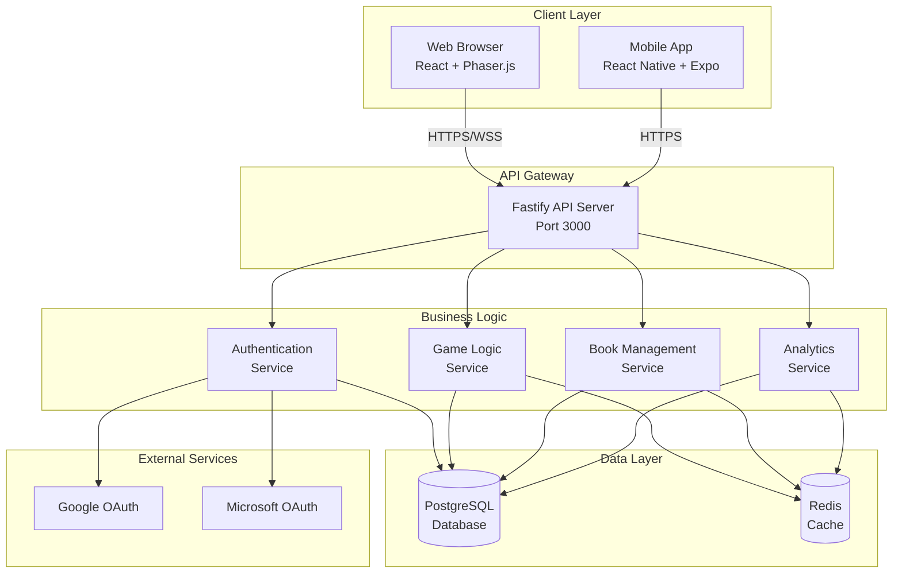

## Component Architecture

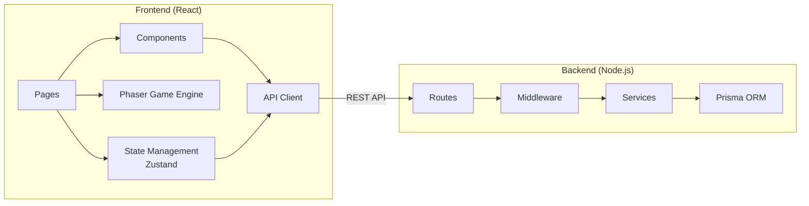

## Data Flow - Student Logs a Book

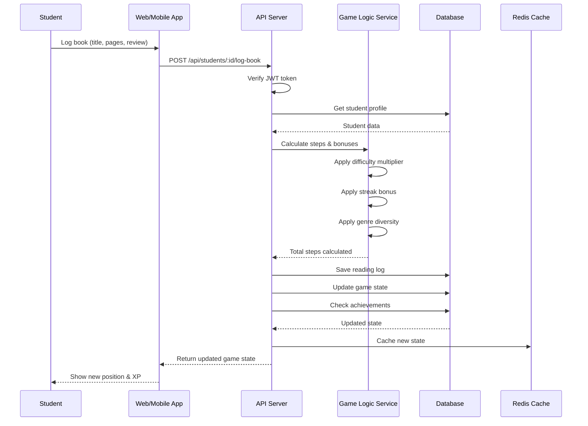

## Authentication Flow

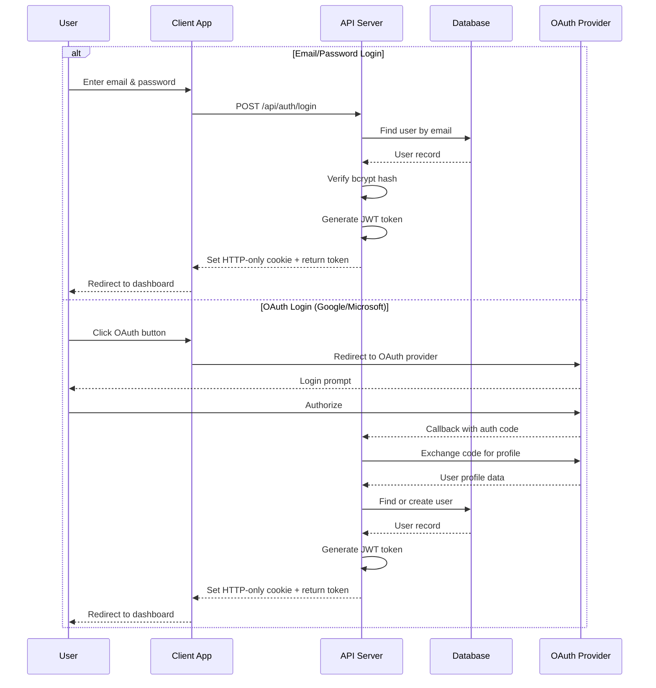

## Database Schema (UML)

```mermaid
erDiagram
    User ||--o{ StudentProfile : has
    User ||--o{ ReadingLog : creates
    User ||--o{ GameState : owns
    User }o--|| School : "belongs to"
    User }o--|| Class : "belongs to"

    StudentProfile ||--o{ Achievement : unlocks

    Class ||--o{ ClassChallenge : has
    Class }o--|| User : "taught by"

    ReadingLog }o--|| Book : references
    ReadingLog ||--o{ GameState : affects

    GameState ||--|| BoardConfig : uses

    User {
        int id PK
        string email UK
        string name
        string passwordHash
        enum role
        datetime createdAt
    }

    StudentProfile {
        int id PK
        int userId FK
        int gradeLevel
        int readingLevel
        int totalPagesRead
        int currentStreak
        int longestStreak
        float totalXP
    }

    ReadingLog {
        int id PK
        int studentId FK
        int bookId FK
        int pagesRead
        string review
        int stepsEarned
        datetime loggedAt
        boolean verified
    }

    GameState {
        int id PK
        int studentId FK
        int currentPosition
        int totalSteps
        int level
        datetime lastUpdated
    }

    Book {
        int id PK
        string title
        string author
        string isbn
        int pageCount
        float difficultyLevel
        string genre
    }

    Achievement {
        int id PK
        string name
        string description
        string icon
        int xpReward
    }
```

## Middleware Pipeline

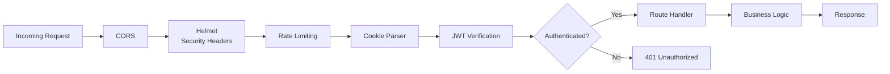

## Deployment Architecture

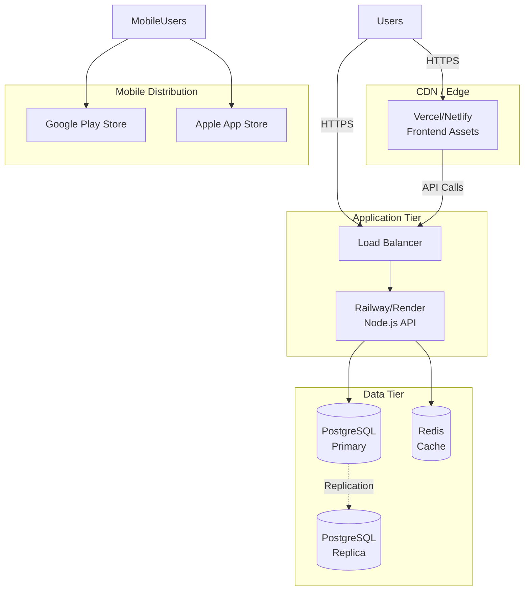

## Game Logic Flow

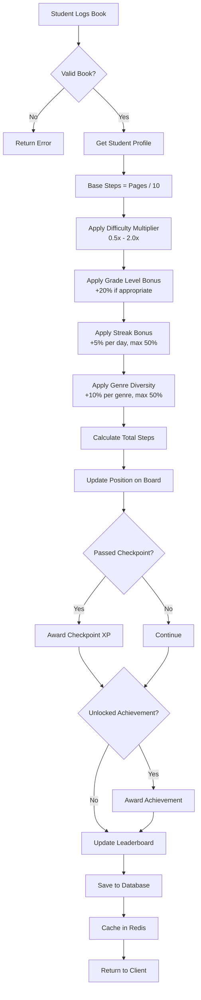

## Technology Stack

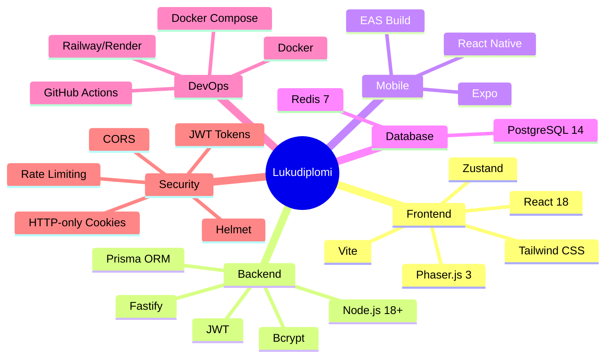

## Performance Optimization Strategy

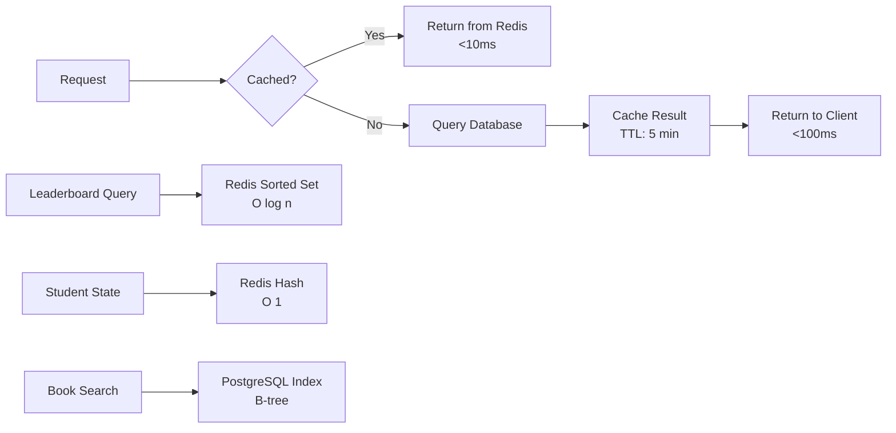

## Scaling Strategy

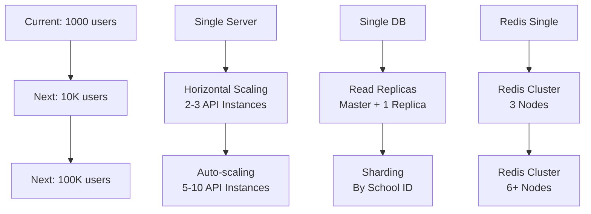

## Security Architecture

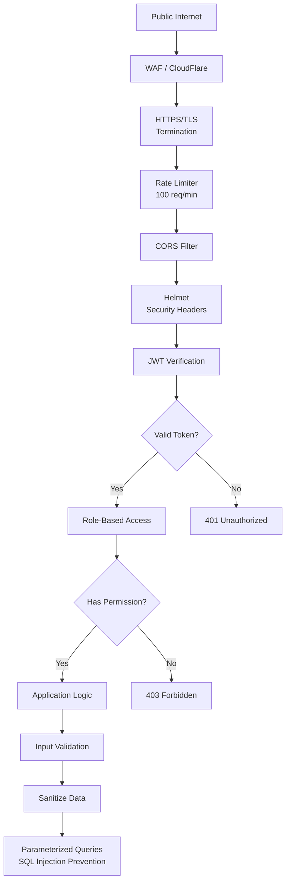

---

## Key Design Decisions

### 1. Server-Authoritative Game Logic
- All game calculations happen on the server
- Prevents cheating and manipulation
- Clients only display results

### 2. Redis Caching Strategy
- Cache frequently accessed data (leaderboards, student states)
- TTL of 5 minutes for most cached data
- Reduces database load by ~70%

### 3. Modular Architecture
- Clear separation: Routes → Middleware → Services → Database
- Easy to test individual components
- Scalable and maintainable

### 4. Multi-Platform Support
- Shared API for web and mobile
- Consistent game logic across platforms
- Phaser.js for engaging web experience

### 5. Progressive Enhancement
- Works on basic browsers
- Enhanced experience with modern features
- Mobile-first responsive design
